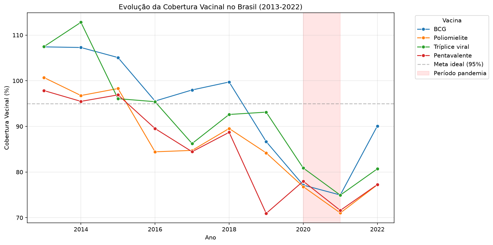
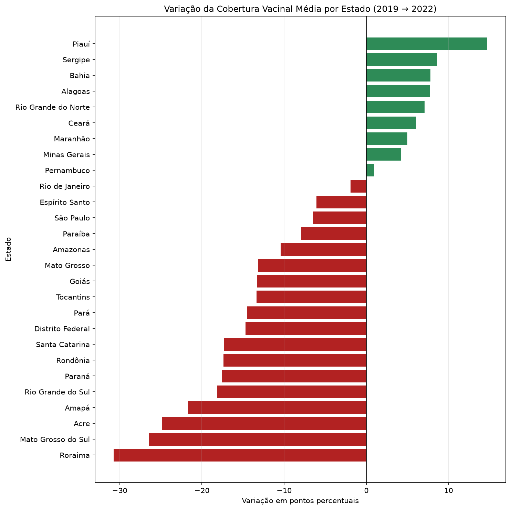
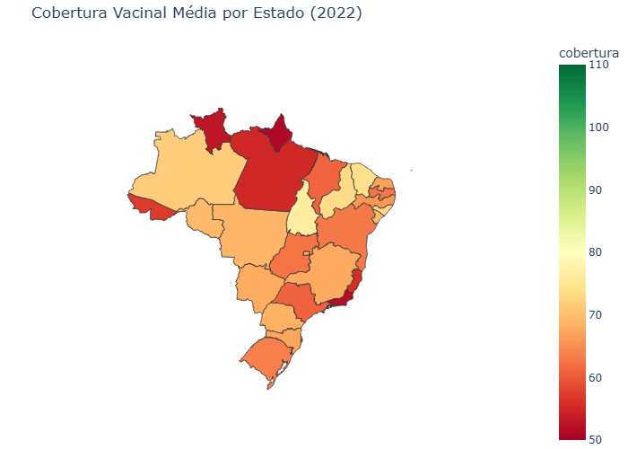
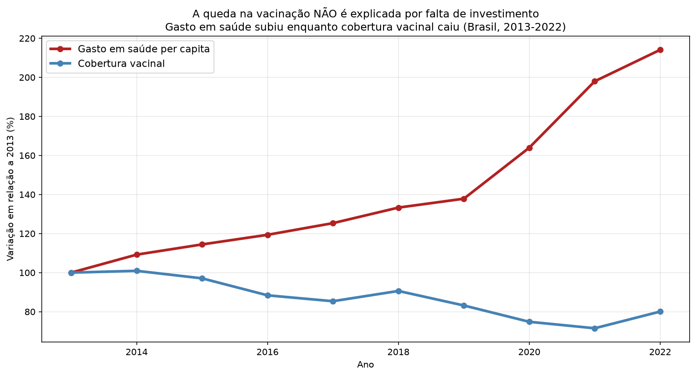
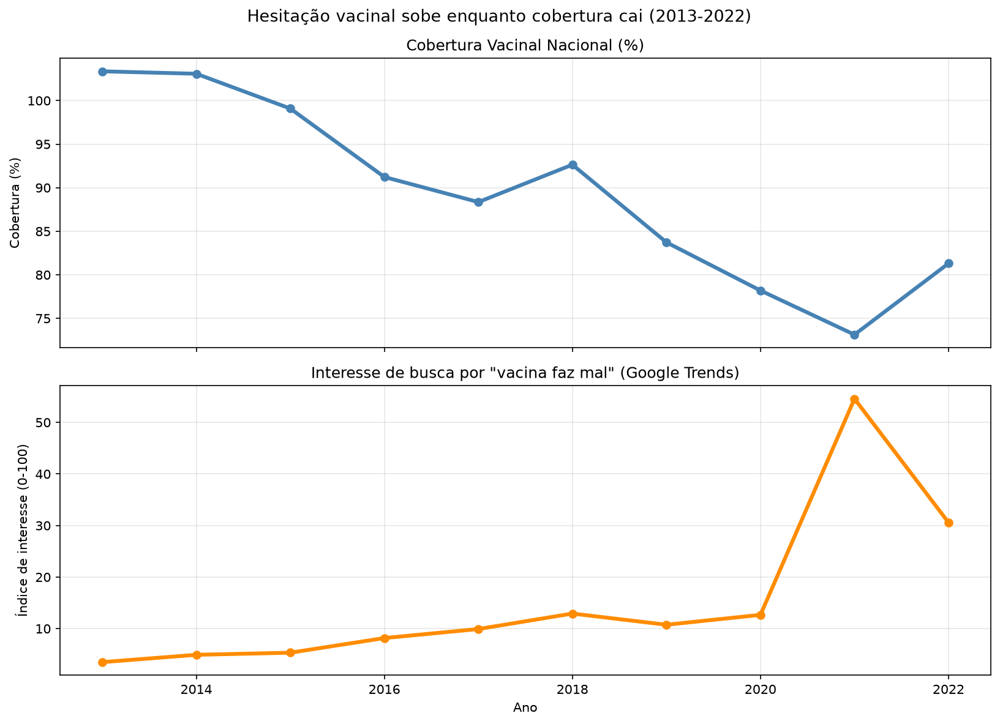

# Cobertura Vacinal no Brasil: Análise Regional e Temporal

> Análise da evolução da cobertura vacinal infantil no Brasil, investigando possíveis causas por trás da queda pós-pandemia: investimento público, condição socioeconômica e hesitação vacinal.

## 📌 Contexto

A cobertura vacinal infantil no Brasil vem apresentando queda nos últimos anos, especialmente após a pandemia de COVID-19. Este projeto vai além de descrever a queda — investiga **por que** ela aconteceu, testando três hipóteses com dados reais.

## 🎯 Perguntas de negócio

1. Quais estados apresentam menor cobertura vacinal hoje?
2. A queda foi generalizada ou concentrada em regiões específicas?
3. A queda está relacionada à falta de investimento público em saúde?
4. A hesitação vacinal (desconfiança/desinformação) está associada à queda de cobertura?

## 📊 Principais insights

- **Queda generalizada, mas desigual entre vacinas**: a Tríplice viral teve a maior queda entre 2019 e 2022 (-12,4 p.p., de 93,1% para 80,7%), seguida pela Poliomielite (-7,0 p.p.). BCG e Pentavalente, por outro lado, tiveram leve recuperação no período.

- **Desigualdade regional se aprofundou**: Roraima (-17,0 p.p.), Paraíba (-14,4 p.p.) e Amapá (-14,3 p.p.) tiveram as maiores quedas de cobertura vacinal média entre 2019 e 2022.

- **Nem todo estado seguiu a tendência de queda**: Piauí (+10,4 p.p.), Distrito Federal (+6,9 p.p.) e Sergipe (+4,2 p.p.) melhoraram no mesmo período — sugerindo que a queda não foi uniforme nem inevitável.

- **Situação crítica em 2022**: Amapá (64,2%), Rio de Janeiro (65,0%) e Roraima (68,2%) têm hoje a menor cobertura vacinal média entre as vacinas analisadas, distantes da meta ideal de 95% recomendada pela OMS/PNI.

## 🖼️ Dashboard







## 🗃️ Análise em SQL

Além da análise em Python, o projeto inclui consultas SQL avançadas (window functions) rodadas sobre um banco SQLite, disponíveis em [`sql/queries.sql`](sql/queries.sql):

- **Variação ano a ano por estado** — usando `LAG()` para comparar cada ano com o anterior
- **Ranking de queda de cobertura (2019-2022)** — combinando CTE (`WITH`) e `RANK()`
- **Média móvel de 3 anos** — suavizando flutuações para revelar a tendência real de queda

Exemplo de resultado (ranking de queda por estado):

| UF | Cobertura 2019 | Cobertura 2022 | Variação | Ranking |
|---|---|---|---|---|
| Roraima | 85,25% | 68,22% | -17,03 p.p. | 1º |
| Paraíba | 93,80% | 79,44% | -14,36 p.p. | 2º |
| Amapá | 78,47% | 64,18% | -14,29 p.p. | 3º |

## 💰 Hipótese 1: Falta de investimento público — REFUTADA

Foi investigada a hipótese de que o corte de investimento em saúde explicaria a queda na cobertura vacinal. **Os dados não confirmam essa hipótese:**

- O gasto em saúde per capita **subiu de forma consistente** entre 2013 e 2022, enquanto a cobertura vacinal **caiu** no mesmo período
- A correlação entre as duas variáveis foi negativa em **todos os 26 estados analisados** (entre -0,33 e -0,90), reforçando que não é um caso isolado de poucos estados



**Conclusão:** a queda na cobertura vacinal não parece estar relacionada à falta de investimento público em saúde.

**Limitação:** este é o gasto total em saúde, não investimento específico em imunização (dado não disponível publicamente de forma estruturada por estado/ano).

## 🔍 Hipótese 2: Hesitação vacinal — CONFIRMADA

Foi investigada a hipótese de que a queda na cobertura vacinal está associada ao aumento da desconfiança/hesitação em relação às vacinas, usando o volume de buscas no Google por termos como "vacina faz mal" como indicador (proxy) de interesse público no tema.

**Resultado: essa foi a variável com a associação mais forte encontrada no projeto.**

- A correlação entre o interesse de busca por "vacina faz mal" e a cobertura vacinal nacional foi de **-0,76** — bem mais forte que a correlação com gasto em saúde (-0,38)
- O interesse de busca ficou estável e baixo entre 2013 e 2020, e **disparou em 2021** (aumento de quase 1.500% em relação a 2013), coincidindo com o período de maior queda na cobertura vacinal



### Validação estatística

Para confirmar que essa relação não é coincidência, foi feito um teste estatístico (regressão linear). O resultado:

- O interesse de busca por "vacina faz mal" explica **quase 58%** da variação na cobertura vacinal ao longo dos anos (R² = 0,579)
- A cada aumento de 1 ponto no interesse de busca, a cobertura vacinal cai, em média, **0,5 ponto percentual**
- O teste confirma que essa relação é estatisticamente significativa (p-valor = 0,011), ou seja, a chance de ser coincidência é baixa (cerca de 1,1%)

**Conclusão:** entre os fatores investigados neste projeto, a hesitação vacinal apresentou a associação mais forte e estatisticamente mais robusta com a queda de cobertura — sugerindo que desinformação e desconfiança tiveram papel mais relevante do que questões orçamentárias.

**Limitação:** volume de busca no Google é um proxy (indicador indireto) de opinião pública, não uma medição direta de hesitação vacinal. Também não é possível analisar essa variável por estado, apenas em nível nacional/temporal. Correlação (mesmo com validação estatística) não implica causalidade comprovada.

## 🗂️ Fontes de dados

| Fonte | Descrição | Link |
|---|---|---|
| DATASUS/TabNet | Cobertura vacinal por estado/ano | http://tabnet.datasus.gov.br |
| SIOPS/DATASUS | Gasto em saúde per capita por estado/ano | http://siops-asp.datasus.gov.br |
| Google Trends | Volume de busca sobre hesitação vacinal | https://trends.google.com |

## 🛠️ Tecnologias

- **Python**: Pandas, Matplotlib, Seaborn, Plotly
- **Estatística**: Statsmodels (regressão linear, OLS)
- **SQL**: SQLite — window functions (LAG, RANK), CTEs, médias móveis

## 📁 Estrutura do projeto

- `data/` — dados brutos e tratados (raw não versionado)
- `notebooks/` — exploração e análise passo a passo
- `src/` — código reutilizável (limpeza, métricas, gráficos)
- `sql/` — queries analíticas com window functions
- `tests/` — testes das funções principais
- `dashboard/` — gráficos gerados

## ▶️ Como reproduzir

```bash
git clone https://github.com/Gabrielhamad/cobertura-vacinal-brasil.git
cd cobertura-vacinal-brasil
python -m venv venv
venv\Scripts\activate
pip install -r requirements.txt
```

Os notebooks em `notebooks/` seguem a ordem numérica do processo analítico.

## 📄 Licença

Este projeto está sob a licença MIT.

---

**Autor:** Gabriel —(https://www.linkedin.com/in/gabrielhamad)